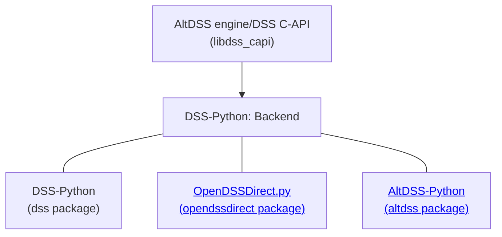

# DSS-Python

[](https://pypi.org/project/dss-python/) [](https://pypi.org/project/dss-python/)   

DSS-Python uses CFFI and NumPy to expose the OpenDSS engine, as implemented in our alternative engine (AltDSS) through the [AltDSS/DSS C-API](https://github.com/dss-extensions/dss_capi) library. OpenDSS is an open-source electric power distribution system simulator [distributed by EPRI](https://sourceforge.net/p/electricdss/). 

This package is available for Windows, Linux and macOS, including Intel and ARM processes, both 32 and 64-bit. As such, it enables OpenDSS to run in many environments the official implementation cannot, from a Raspberry Pi to a HPC cluster, and cloud environments like Google Colab (some of our notebooks examples are ready-to-run on Colab).

DSS-Python is part of DSS-Extensions, a larger effort to port the original OpenDSS to support more platforms (OSs, processor architectures), programming languages, and extend both the OpenDSS engine and API, represented in the AltDSS engine:

<p align="center">
    
</p>

For alternatives for other programming languages, including in MATLAB, C++, C#/.NET, Rust and Go, please check [https://dss-extensions.org/](https://dss-extensions.org/) and our hub repository at [dss-extensions/dss-extensions](https://github.com/dss-extensions/dss-extensions) for more documentation, discussions and the [FAQ](https://github.com/dss-extensions/dss-extensions#faq).

<center>



</center>

DSS-Python is one of three Python projects under DSS-Extensions. See [DSS-Extensions — OpenDSS: Overview of Python APIs](https://dss-extensions.org/python_apis.html) for a brief comparison between these and the official COM API. Both OpenDSSDirect.py and DSS-Python expose the classic OpenDSS API (closer to the COM implementation). For an alternative API which exposes all OpenDSS objects, batch operations, and a more intuitive API, check [AltDSS-Python](https://dss-extensions.org/AltDSS-Python/). If required, users can mix all three packages in the same project to access some of their unique features.


## Brief introduction

Install it with `pip` (or `pip3` depending on your environment, or even `python -m pip`), e.g.:

```shell
pip install dss-python
```

To enable all the features available, which require more modules, use the `all` variation:

```shell
pip install dss-python[all]
```


In this documentation, since many features from DSS-Python are not available in the official version, we mark the extra features as "**(API Extension)**". As such, the documentation could be somewhat useful for OpenDSS users stuck with the COM version. As a reminder, we provide `patch_dss_com` to introduce some of the quality-of-life features such as Python iterators and more to an `OpenDSSengine.DSS` COM object, in an effort to provide compatibility when users are either migrating, validating results or just need to provide support for both the official engine and the DSS-Extensions version. "**(API Extension)**" is used to mark whole classes, as seen below, or individual extra properties and functions. Not all extensions are marked, so be sure to check when in doubt.

Independent of which OpenDSS implementation you use, it is good practice to list the specific implementation begin used (e.g. from EPRI or from DSS-Extensions). At the moment we do not generate DOIs for our packages, but users can always cite a specific version on PyPI, e.g. https://pypi.org/project/dss-python/0.12.1/

Check http://dss-extensions.org and https://github.com/dss-extensions/dss-extensions for links to more documentation and examples. Besides our own documentation, the official OpenDSS documentation is extensive and covers various topics.

We recommend looking especially in the following resources:

   * https://opendss.epri.com/opendss_documentation.html
   * https://sourceforge.net/p/electricdss/code/3706/tree/trunk/Version8/Distrib/Doc/ (old version of the above, with separate PDFs, etc.)

See also https://dss-extensions.org/OpenDSSDirect.py/ for a package that uses function-style getters and setters, 
instead of Python properties, but reusing the base of this package. Most concepts presented here are shared and 
we avoid duplicating the effort. We envision a joint documentation site in the future. A new package called [**Alt**DSS-Python](https://dss-extensions.org/AltDSS-Python) is being developed to address the limitations of both DSS-Python and OpenDSSDirect.py using an original approach.

## Missing features and limitations

Most limitations are inherited from `dss_capi`, i.e., these are not implemented:

- `DSSProgress` from `DLL/ImplDSSProgress.pas`: would need a reimplementation depending on the target UI (GUI, text, headless, etc.). Can be achieved with the current API.
- OpenDSS-GIS features are not implemented since they're not open-source (nor free/openly available).

Previous missing features, such as support for most `plot` commands and the "Events" interface, have been implemented.

## Extra features

In general, the `dss_capi` library from DSS-Extensions provides more features than both the official Direct DLL and the COM object.

Besides most of the methods available in the OpenDSS COM DLL, some of the unique DDLL methods are also exposed in adapted forms, namely the methods from `DYMatrix.pas`, especially `GetCompressedYMatrix` (check the source files for more information).

While OpenDSS relies on windows/forms to report errors, or require the user to check the `Error` interface manually, most DSS-Extensions do that automatically for the majority of the API calls. We also introduce extended error messages, more thorough error checking in the Pascal code, and even some basic tracebacks for the .DSS script handling. All the changes combined should result in a more comfortable and fluid experience for the Python user.

**TO BE EXPANDED**

## The DSS instance

Although there are many classes and modules in DSS-Python, the main usage is typically
through the default DSS instance, and that is the most interest aspect for most users.

DSS-Python tries to be a drop-in replacement for the official OpenDSS COM implementation, within reasonable limits.
There are two main Python packages that allow instantiating COM objects, `win32com` and `comtypes`. 

For a quick look into some Python APIs (COM, DSS-Python, OpenDSSDirect.py) for the OpenDSS (official or our alternative 
implementation), see [DSS-Extensions — OpenDSS: Overview of Python APIs](https://dss-extensions.org/python_apis.html).

Usually, your code would contain the instantiation of the objects such as:

```python
   import win32com.client 
   DSS = win32com.client.gencache.EnsureDispatch("OpenDSSEngine.DSS")
```

or maybe:

```python
   import win32com.client 
   DSS = win32com.client.Dispatch("OpenDSSEngine.DSS")
```

or with `comtypes`:

```python
   import comtypes.client
   DSS = comtypes.client.CreateObject("OpenDSSEngine.DSS")
```

Either way, to use DSS-Python and effectively migrate from the official OpenDSS COM interface, you can replace that fragment with:

```python
   from dss import DSS
```

If the code didn't depend on very specific details like lists vs tuples vs NumPy arrays, it should be compatible. Note that even replacing `win32com` with `comtypes` already introduces small inconsistencies. These, though, should not matter much in Python.

For a quick overview of DSS-Python, the main DSS class is organized as follows. Click through {class}`DSS <dss.IDSS.IDSS>` to browse and discover other properties and methods, including many of the extensions we've been adding in the past several years.

- {class}`DSS.Parser <dss.IParser.IParser>`

- {class}`DSS.Events <dss.IDSSEvents.IDSSEvents>`

- {class}`DSS.Text <dss.IText.IText>`

- {class}`DSS.YMatrix <dss.IYMatrix.IYMatrix>` **(API Extension)**

- {class}`DSS.ZIP <dss.IZIP.IZIP>` **(API Extension)**

- {class}`DSS.ActiveCircuit <dss.ICircuit.ICircuit>`:
   - {class}`DSS.ActiveCircuit.ActiveBus <dss.IBus.IBus>`
   - {class}`DSS.ActiveCircuit.ActiveCktElement <dss.ICktElement.ICktElement>`
   - {class}`DSS.ActiveCircuit.ActiveClass <dss.IActiveClass.IActiveClass>`
   - {class}`DSS.ActiveCircuit.ActiveDSSElement <dss.IDSSElement.IDSSElement>`
   - {class}`DSS.ActiveCircuit.ActiveElement <dss.ICktElement.ICktElement>`
   - {class}`DSS.ActiveCircuit.Buses <dss.IBus.IBus>`
   - {class}`DSS.ActiveCircuit.Capacitors <dss.ICapacitors.ICapacitors>`
   - {class}`DSS.ActiveCircuit.CapControls <dss.ICapControls.ICapControls>`
   - {class}`DSS.ActiveCircuit.CNData <dss.ICNData.ICNData>` **(API Extension)**
   - {class}`DSS.ActiveCircuit.CtrlQueue <dss.ICtrlQueue.ICtrlQueue>`
   - {class}`DSS.ActiveCircuit.DSSim_Coms <dss.IDSSimComs.IDSSimComs>`
   - {class}`DSS.ActiveCircuit.Fuses <dss.IFuses.IFuses>`
   - {class}`DSS.ActiveCircuit.Generators <dss.IGenerators.IGenerators>`
   - {class}`DSS.ActiveCircuit.GICSources <dss.IGICSources.IGICSources>`
   - {class}`DSS.ActiveCircuit.ISources <dss.IISources.IISources>`
   - {class}`DSS.ActiveCircuit.LineCodes <dss.ILineCodes.ILineCodes>`
   - {class}`DSS.ActiveCircuit.LineGeometries <dss.ILineGeometries.ILineGeometries>` **(API Extension)**
   - {class}`DSS.ActiveCircuit.Lines <dss.ILines.ILines>`
   - {class}`DSS.ActiveCircuit.LineSpacings <dss.ILineSpacings.ILineSpacings>` **(API Extension)**
   - {class}`DSS.ActiveCircuit.Loads <dss.ILoads.ILoads>`
   - {class}`DSS.ActiveCircuit.LoadShapes <dss.ILoadShapes.ILoadShapes>`
   - {class}`DSS.ActiveCircuit.Meters <dss.IMeters.IMeters>`
   - {class}`DSS.ActiveCircuit.Monitors <dss.IMonitors.IMonitors>`
   - {class}`DSS.ActiveCircuit.Parallel <dss.IParallel.IParallel>`
   - {class}`DSS.ActiveCircuit.PDElements <dss.IPDElements.IPDElements>`
   - {class}`DSS.ActiveCircuit.PVSystems <dss.IPVSystems.IPVSystems>`
   - {class}`DSS.ActiveCircuit.Reactors <dss.IReactors.IReactors>` **(API Extension)**
   - {class}`DSS.ActiveCircuit.Reclosers <dss.IReclosers.IReclosers>`
   - {class}`DSS.ActiveCircuit.ReduceCkt <dss.IReduceCkt.IReduceCkt>`
   - {class}`DSS.ActiveCircuit.RegControls <dss.IRegControls.IRegControls>`
   - {class}`DSS.ActiveCircuit.Relays <dss.IRelays.IRelays>`
   - {class}`DSS.ActiveCircuit.Sensors <dss.ISensors.ISensors>`
   - {class}`DSS.ActiveCircuit.Settings <dss.ISettings.ISettings>`
   - {class}`DSS.ActiveCircuit.Solution <dss.ISolution.ISolution>`
   - {class}`DSS.ActiveCircuit.Storages <dss.IStorages.IStorages>`
   - {class}`DSS.ActiveCircuit.SwtControls <dss.ISwtControls.ISwtControls>`
   - {class}`DSS.ActiveCircuit.Topology <dss.ITopology.ITopology>`
   - {class}`DSS.ActiveCircuit.Transformers <dss.ITransformers.ITransformers>`
   - {class}`DSS.ActiveCircuit.TSData <dss.ITSData.ITSData>` **(API Extension)**
   - {class}`DSS.ActiveCircuit.Vsources <dss.IVsources.IVsources>`
   - {class}`DSS.ActiveCircuit.WireData <dss.IWireData.IWireData>` **(API Extension)**
   - {class}`DSS.ActiveCircuit.XYCurves <dss.IXYCurves.IXYCurves>`


## Plotting and notebook integration

Initial plotting support was added in DSS-Python v0.12.1, and an almost complete implementation is available since
v0.14.2. There are some features lacking in comparison to the official implementation (as of June 2023), especially
interactive inspection. 

To enable:

```python
   from dss import dss, plot
   plot.enable()
```

After that, running the plot commands from the text interface or compile/redirect scripts will try to use matplotlib to
reproduce most of the plot options from the official OpenDSS.

```python
   dss.Text.Command = 'compile some_circuit/Master.dss'
   dss.ActiveCircuit.Solution.Solve()
   dss.Text.Command = 'plot profile'
```

As a reminder, after activating, this can be used with `OpenDSSDirect.py <https://dss-extensions.org/OpenDSSDirect.py/>` too.

A notebook with an example gallery of various plot commands and how to customized the matplotlib output is available: ()[examples/Plotting].


## Documentation

The documentation pages are organized as follows.

```{toctree}
:maxdepth: 1
:caption: General
self
examples/GettingStarted
Changelog <changelog>
```

```{toctree}
:maxdepth: 1
:caption: Examples
Plotting <examples/Plotting>
JSON export/import (WIP) <examples/JSON>
User-models (PyIndMach012) <examples/UserModels/PyIndMach012/README>
examples/Multithreading
```

```{toctree}
:maxdepth: 1
:caption: API Reference
dss.enums <enumerations>
dss package <apidocs/index.rst>
```

```{toctree}
:maxdepth: 1
:hidden:
:caption: External links
GitHub repository <https://github.com/dss-extensions/dss_python>
Package on PyPI <https://pypi.python.org/pypi/OpenDSSDirect.py/>
Test/example circuits <https://github.com/dss-extensions/electricdss-tst>
DSS-Extensions/FAQ <https://github.com/dss-extensions/dss-extensions#faq>
OpenDSSDirect.py <https://dss-extensions.org/OpenDSSDirect.py>
AltDSS-Python <https://dss-extensions.org/AltDSS-Python/>
DSS-Extensions Discussions <https://github.com/orgs/dss-extensions/discussions>
OpenDSS forum <https://sourceforge.net/p/electricdss/discussion/>
OpenDSS documentation <https://opendss.epri.com/opendss_documentation.html>
```


# Indices and tables

* [](genindex)
* [](modindex)
* [](search)
